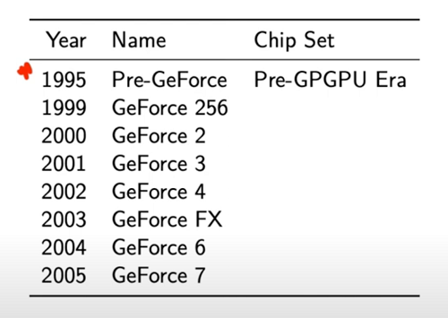
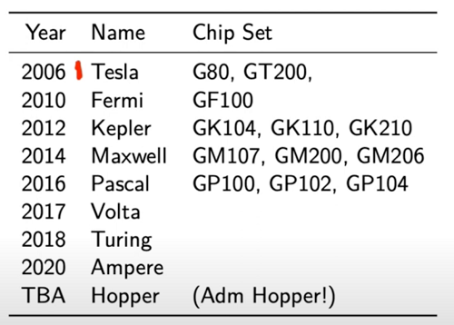
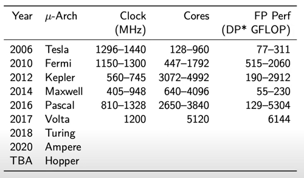
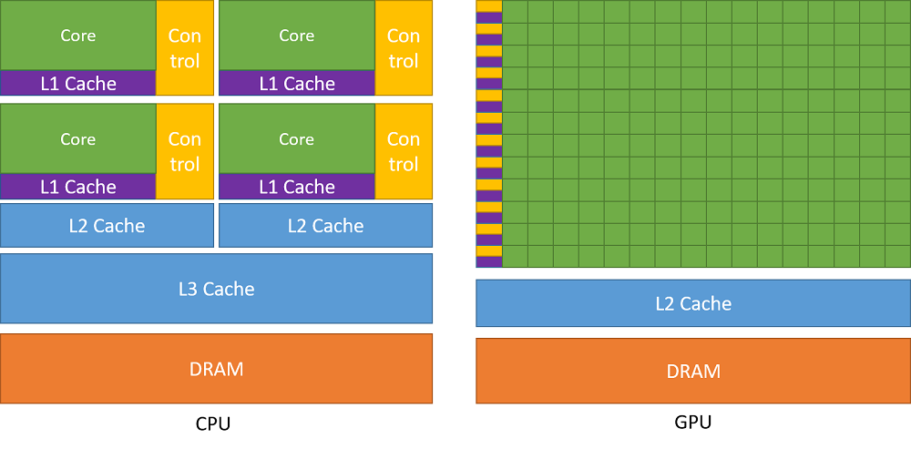

# A gentle intro to GPUs
Background & history about the GPU itself, why is it used for deep learning tasks, why its way faster than the CPU at certain tasks.

## Hardware
- CPU: Central Processing Unit 
    - General purpose
    - High clock speed
    - Few cores
    - High cache
    - Low Latency
    - Low throughput

- GPU: Graphics Processing Unit 
    - Specialized
    - Low clock speed
    - Many cores
    - Low cache
    - High Latency
    - High throughput

- TPU: Tensor Processing Unit 
    - Specialized GPUs for deep learning algorithms (matrix multiplication, etc)

- FPGA: Field Programmable Gate Array 
    - Specialized hardware that can be reconfigured to perform specific tasks
    - Very low latency
    - Very high throughput
    - Very high power consumption
    - Very high cost

## NVIDIA GPU History
> Brief history of NVIDIA GPUs -> https://www.youtube.com/watch?v=kUqkOAU84bA

## What makes GPUs so fast for deep learning?

- CPU (host)
    - minimize time of one task
    - metric: latency in seconds

- GPU (device)
    - maximize throughput
    - metric: throughput in tasks per second (ex: pixels per ms)

## Typical CUDA program
1. CPU allocates CPU memory
2. CPU copies data to GPU
3. CPU launches kernel on GPU (processing is done here)
4. CPU copies results from GPU back to CPU to do something useful with it

Kernel looks like a serial program; says nothing about parallelism. Similar to solving a jigsaw puzzle and all that's given is the location of each puzzle piece. The high level algorithm would be designed to take these individual pieces, and solve a single problem for each of them; “put the piece in the correct spot”. As long as all the pieces are assembled in the right place at the end, it works! No need to start at one corner and work your way across the puzzle. Possible to solve multiple pieces at the same time, as long as they don't interfere with each other.

## Some terms to remember
- kernels (not popcorn, not convolutional kernels, not linux kernels, but GPU kernels)
- threads, blocks, and grid (next chapter)
- GEMM = **GE**neral **M**atrix **M**ultiplication
- SGEMM = **S**ingle precision (fp32) **GE**neral **M**atrix **M**ultiplication
- cpu/host/functions vs gpu/device/kernels
- CPU is referred to as the host. It executes functions. 
- GPU is referred to as the device. It executes GPU functions called kernels.

