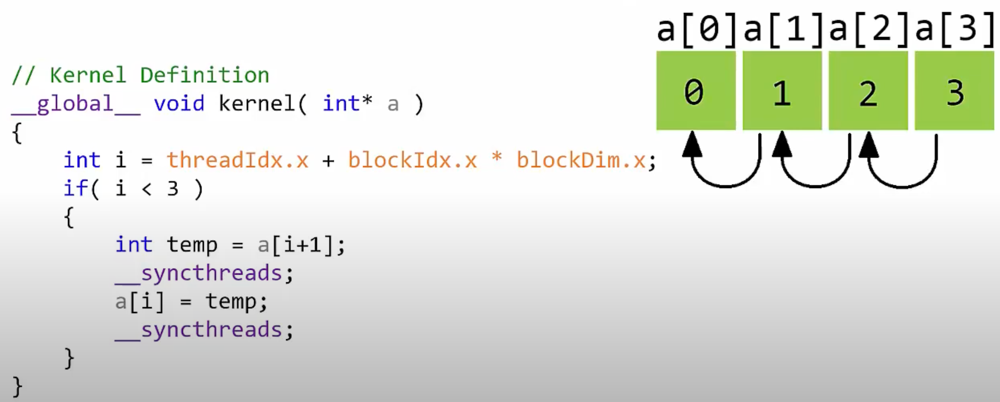

# Kernels

## Kernel Launch Params

- Type `dim3` is 3D type for grids and thread blocks which are later feed into the kernel launch configuration.

- allows for indexing of elements as vector, matrix, or volume (tensor)

- dim3 theory [link](https://codeyarns.com/tech/2011-02-16-cuda-dim3.html)

```cpp
dim3 gridDim(4, 4, 1); // 4 blocks in x, 4 block in y, 1 block in z
dim3 blockDim(4, 2, 2); // 4 threads in x, 2 thread in y, 2 thread in z
```

- other type is `int` which specifies a 1D vector

```cpp
int gridDim = 16; // 16 blocks
int blockDim = 32; // 32 threads per block
<<<gridDim, blockDim>>>
// these aren't dim3 types but they are still valid if the indexing scheme is 1D
```

- gridDim --> gridDim.x * gridDim.y * gridDim.z = # of blocks being launched

- blockDim --> blockDim.x * blockDim.y * blockDim.z = # of threads per block

- total threads = (threads per block) \* # of blocks

- The execution configuration (of a global function call) is specified by inserting an expression of the form `<<<gridDim, blockDim, Ns, S>>>`, where:

  - gridDim (dim3) specifies the dimension and size of the grid.
  - blockDim (dim3) specifies the dimension and size of each block
  - Ns (size_t) specifies the number of bytes in shared memory that is dynamically allocated per block for this call in addition to the statically allocated memory. (typically omitted)
  - S (cudaStream_t) specifies the associated stream, is an optional parameter which defaults to 0.

> source -> https://stackoverflow.com/questions/26770123/understanding-this-cuda-kernels-launch-parameters

## Thread Synchronization

- `cudaDeviceSynchronize();` --> makes sure all the kernel for one problem are caught up for safe continuation. It's a barrier. Called `int main() {}` or another non-`__global__` function.


- `__syncthreads();` to put a barrier for thread execution **inside** the kernel. Useful if accessing the same memory spots and needs all the other jobs to catch up before start making edits to a certain place. Example: one worker might be halfway done doing stuff to a place in memory. Another worker might already be done the job task that the first worker is still doing. If this faster worker messes with a piece of memory that the slower worker still needs, it leads to numerical instability and errors.

- `__syncwarps();` sync all threads within a warp

- *What is the need to synchronize threads?* Threads are asynchronous and can be executed in any order. Given a thread that is dependent on another thread, need to make sure that the thread that is dependent on the other thread is not executed before the other thread is done.
  - For example, if vector add the two arrays `a = [1, 2, 3, 4]`, `b = [5, 6, 7, 8]` and store the result in `c`, then add 1 to each element in `c`, need to ensure all the multiply operations catch up before moving onto adding (following PEDMAS). If no clear threads sync, there is a possibility that one gets an incorrect output vector where a 1 is added before a multiply.
  - A more clear but less common example would parallelized bit shift. If there is a bit shift operation that is dependent on the previous bit shift operation, one needs to make sure that the previous bit shift operation is done before we move onto the next one
  
  


## Thread Safety

- [Is CUDA thread-safe?](https://forums.developer.nvidia.com/t/is-cuda-thread-safe/2262/2)
- When a piece of code is "thread-safe" it can be run by multiple threads at the same time
  without leading to race conditions or other unexpected behaviour.

- Race conditions: one thread starts the next task before another finishes.
  to prevent race conditions, one can use a special function called `cudaDeviceSynchronize()`
  to ensure all threads are caught up before giving them a new instruction to work on.
  Analogy is a bunch of threads racing to the finish line, some finish before others
  for some reason and one has to manually tell those "winner" threads to wait at the
  finish line for all to arrive.

- Possible to call multiple GPU kernels with different CPU threads, reference in the link above.

## SIMD/SIMT (Single Instruction, Multiple Threads)

- [Can CUDA use SIMD instructions?](https://stackoverflow.com/questions/5238743/can-cuda-use-simd-extensions)
- Similar to CPU SIMD (single instruction multiple data), there are single instruction multiple thread on GPU.
- Instead of running the for loop sequentially, each thread can run a single iteration of the for loop so that it appears to only take the time of one iteration. It can grow linearly if one adds more and more iterations as expected (not enough cores to parallel process all the independent iterations of the for loop)
- Simpler than CPU
  - in-order instruction issue
  - no branch prediction
  - significantly less control than CPU architecture gives us more room for more CORES

> Optimzations connected to these special warp ops: [Warp Level Primitives](https://developer.nvidia.com/blog/using-cuda-warp-level-primitives/)

- [thread hierarchy docs](https://docs.nvidia.com/cuda/cuda-c-programming-guide/index.html#thread-hierarchy) cite "There is a limit to the number of threads per block, since all threads of a block are expected to reside on the same streaming multiprocessor core and must share the limited memory resources of that core. On current GPUs, a thread block may contain up to 1024 threads.",
  - **Conclusion**: 1024 threads per block, 32 threads per warp, and 32 warps per block is current theoretical limit.

## Math intrinsics
- device-only hardware instructions for fundamental math operations
- [cuda-math-api](https://docs.nvidia.com/cuda/cuda-math-api/index.html)
- possible to use host designed operations like `log()` (host) instead of `logf()` (device) but they *will run slower*. These math essentials allow very math math operations on the device/GPU. Can pass in `-use_fast_math` to the nvcc compiler to convert to these device only ops at the cost of barely noticeable precision error.
- `--fmad=true` for fused multiply-add
