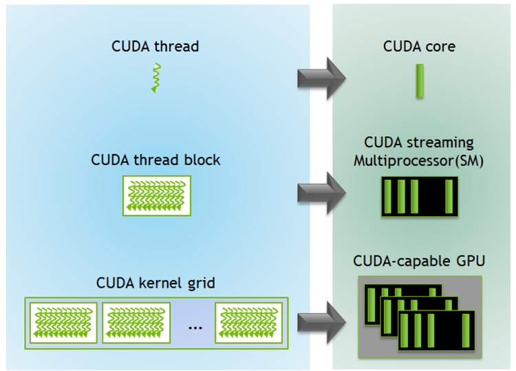
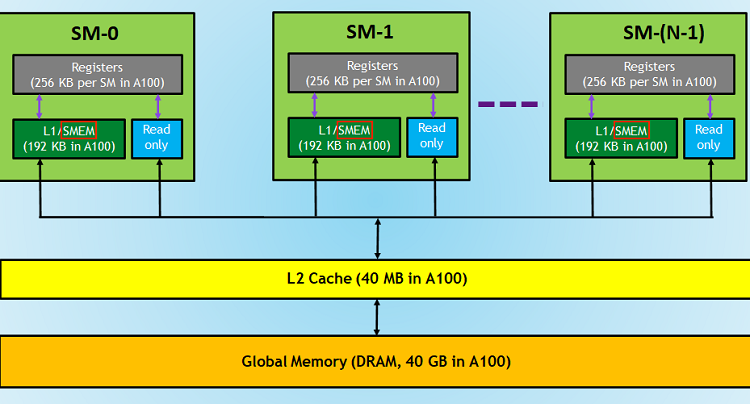

# CUDA Kernels

As a general idea about GPU performance, [link](https://github.com/NVIDIA/cuda-samples) contains feature demonstrations for CUDA toolkit. Follow instructions.

> Everything starts here -> https://docs.nvidia.com/cuda/
> Focus on the CUDA C programming guide -> https://docs.nvidia.com/cuda/cuda-c-programming-guide/index.html
> Consider following along here -> https://developer.nvidia.com/blog/even-easier-introduction-cuda/

- its generally a good idea to write code for a kernel first on CPU (easy to write), then on GPU to ensure your logic lines up on the level of blocks and threads. you can set some input x, feed it through the CPU function and GPU kernel, check if outputs are the same. this tells you if your GPU code is working as expected

## Hardware Mapping

- CUDA cores handle threads
- Streaming Multiprocessors (SMs) handle blocks (typically multiple blocks per SM depending on resources required)
- Grids are mapped to the entire GPU since they are the highest level of the hierarchy

## Memory Model

- Registers & Local Memory
- Shared Memory --> allows threads within a block to communicate
- L2 cache. acts as buffer between cores/registers and global mem. also is a shared memory across SMs
- L2 cache and Shared/L1 cache both use the same circuitry as SRAM so they run at about the same speed. L2 cache is bigger
- Speed: While both use SRAM, L2 is generally slower than L1. This is not due to the underlying technology, but rather due to:
  - Size: L2 is larger, which increases access time.
  - Shared nature: L2 is shared among all SMs, requiring more complex access mechanisms.
  - Physical location: L2 is typically further from the compute units than L1.
- Global Memory --> Stores data copies to and from Host. Everything on device can access Global mem
- Host --> 16/32/64GB DRAM depending on rig
- Arrays too big to fit into the Register will spill into local memory. General goal is to make sure this doesn't happen because best to keep program running as fast as possible

### What is _random_ access memory?

- in a video tape: access the bits sequentially to reach
  the last ones. random refers to the nature of instantly getting information
  from a given random index (without relying on having to index anything else). Provided abstraction that seems like memory is a giant line but on chip its actually layed out as a grid (circuitry takes care of things here)

> [Efficient Matrix Tranpose Nvidia Blog Post](https://developer.nvidia.com/blog/efficient-matrix-transpose-cuda-cc/)

