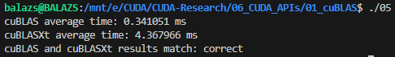
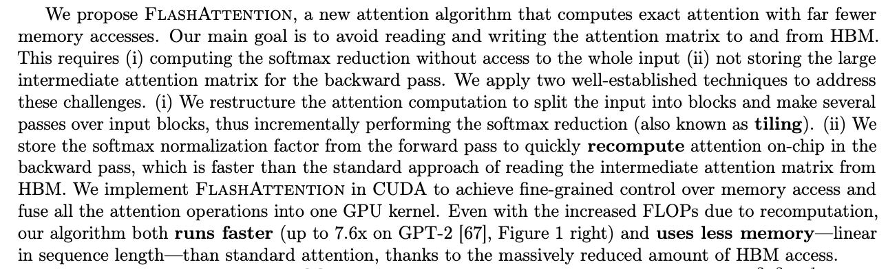

> Note: Its important to note that doing warmup and benchmark runs is a good way to get a more accurate measurement of the time it takes to execute a function. Without doing any warmup runs, cuBLAS will have a lot of overhead from the first run and it will skew the results (~45ms). Benchmark runs are used to get a more accurate average time.

# cuBLAS

- NVIDIA **CUDA Basic Linear Algebra Subprograms** is a GPU-accelerated library for accelerating AI and HPC (high performance compute) applications. It includes several API extensions for providing drop-in industry standard BLAS APIs and GEMM (general matrix multiplication) APIs with support for fusions that are highly optimized for NVIDIA GPUs.
- Super relevant: shaping (https://stackoverflow.com/questions/56043539/cublassgemm-row-major-multiplication)

Important! Compile with `nvcc -o exec code.cu -lcublas`

## cuBLAS-Lt
- **cuBLASLt (cuda BLAS Lightweight)** is an extension of the cuBLAS library that provides a more flexible API, primarily aimed at improving performance for specific workloads like deep learning models. Close to all the datatypes and API calls are tied back to matmul.
- In cases where a problem cannot be run by a single kernel, cuBLASLt will attempt to decompose the problem into multiple sub-problems and solve it by running the kernel on each sub-problem.
- This is where fp16/fp8/int8 kicks in.
- Funfact, [cublas-lt docs](https://docs.nvidia.com/cuda/cublas/#cublasltmatmul) state that the leading dimensions of matrices (for multiplication) need to be multiples of 4.

Important! Compile with `nvcc -o exec code.cu -lcublasLt`; Note: `-lcublas` link might be needed by hybrid implementations. 

## cuBLAS-Xt
- cublas-xt for host + gpu solving (way slower)
- Since there is a need for transfer between motherboard DRAM and GPU VRAM, memory bandwidth bottlenecks show up and can't compute as fast as doing everything on-chip.

- **cuBLASXt** is an extension to cuBLAS that enables multi-GPU support. Key features include:
    - **Multiple GPUs:** Ability to run BLAS operations across multiple GPUs, allowing for GPU scaling and potentially significant performance improvements on large datasets.
    - **Thread Safety:** Designed to be thread-safe, enabling concurrent execution of multiple BLAS operations on different GPUs.

Ideal for large-scale computations that can benefit from distributing workloads across multiple GPUs.

Choose XT for large-scale linear algebra that exceeds GPU memory

- cuBLAS vs cuBLAS-Xt
    - `(M, N) @ (N, K)` where M = N = K = 512
    - 

Important! Compile with `nvcc -o exec code.cu -lcublas`; Note: `-lcublas` link enough for cuBLASXt. 

## cuBLASDx

The cuBLASDx library (preview) is a device side API extension for performing BLAS calculations inside CUDA kernels. By fusing numerical operations latency decrease can be achieved, thus further improving application performance.

- [cuBLASDx documentation](https://docs.nvidia.com/cuda/cublasdx).
- cuBLASDx is not a part of the CUDA Toolkit. Downloaded separately from [link](https://developer.nvidia.com/cublasdx-downloads).

## CUTLASS
- cuBLAS and its variants are run on the host, and whatever comes with cuBLAS-DX isn't super well documented or optimized. 
- Matrix multiplication is the most important operation in deep learning, and cuBLAS doesn't let easily fuse operations together. 
- [CUTLASS](https://github.com/NVIDIA/cutlass) (CUDA Templates for Linear Algebra Subroutines) on the other hand (in optional section) allows for that.
- FYI, flash attention is not using CUTLASS, just optimized CUDA kernels (cite below)
 -> src: https://arxiv.org/pdf/2205.14135
