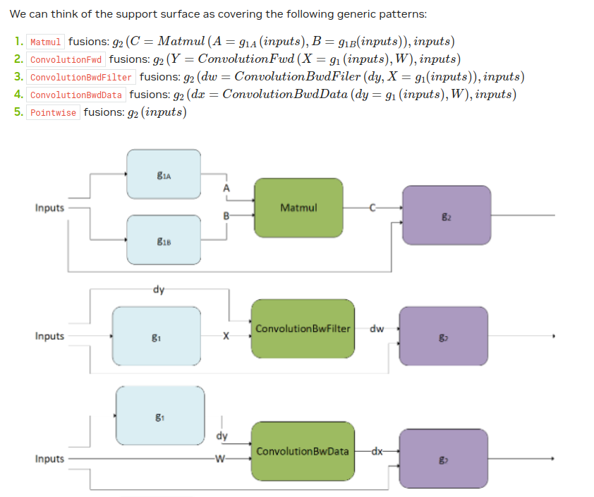
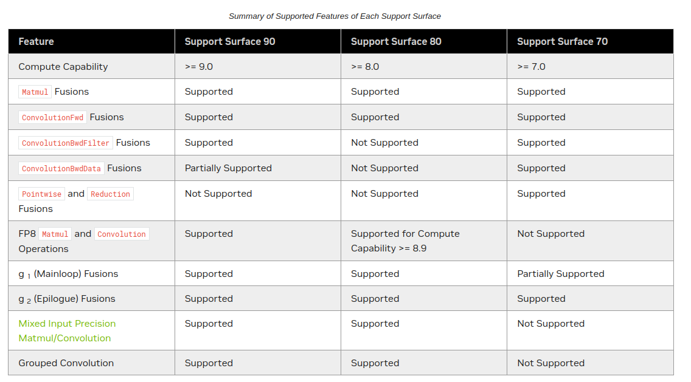

# cuDNN
There is virtually no need for cuFFT or a ton of manually written custom kernels to write a GPT training run + inference. Fast convolve is built into cuDNN, and cuBLAS matmul is included in cuDNN at greater abstraction. Still a good idea to review the idea of slow conv, fast conv, slow matmul, fast matmul.

> Important! Compile with `nvcc -o exec code.cu -lcudnn`

NVIDIA cuDNN provides highly tuned implementations of operations arising frequently in deep learning applications:
- convolution forward and backward including cross-correlation
- GEMM (general matrix multiply)
- pooling forward and backward
- softmax forward and backward
- neuron activations forward and backward: relu, tanh, sigmoid, elu, gelu, softplus, swishArithmetic, mathematical, relational, and logical pointwise operations (including various flavors of forward and backward neuron activations), etc.
- tensor transformation functions (reshape, transpose, concat, reshape, etc.)
- LRN, LCN, batch normalization, instance normalization, and layer normalization forward and backward
- much more...

Beyond just providing performant implementations of individual operations, the library also supports a flexible set of multi-operation fusion patterns for further optimization. The goal is to achieve the best available performance on NVIDIA GPUs for important deep learning use cases.

*Rough idea* when it comes to cuDNN docs: gives tensor descriptor types implemented as “opaque struct types”, previously talked about. These descriptors can create tensors, define tensor operations, get attributes about tensors, and more. Decently well done documentation can be found [here](https://docs.nvidia.com/deeplearning/cudnn/latest/api/overview.html).

## Major Changes
In cuDNN version 7 and older, the API was designed to support a fixed set of operations and fusion patterns. We informally call this the “legacy API”. Starting in cuDNN version 8, to address the quickly expanding set of popular fusion patterns, we added a [Graph API](https://docs.nvidia.com/deeplearning/cudnn/latest/developer/graph-api.html#graph-api), which allows the user to express a computation by defining an operation graph, rather than by selecting from a fixed set of API calls. This offers better flexibility versus the legacy API, and for most use cases, is the recommended way to use cuDNN.

Initially confusing: term “Graph API” with operations to do with graph neural networks. It turns out this just lets users define the graph of operations they'd prefer in the form of a Graph. Rather than using fixed operations (legacy API) one can’t actually see code for under the hood (since its a precompiled binary), but get an API to add to without directly changing the low level source code. 

## Engines of CuDNN
1. **Pre-compiled Single Operation Engines**:
    - These engines are pre-compiled and optimized for a specific single operation. Because they are pre-compiled, they offer very efficient execution but are inflexible in terms of the operations they can perform.
    - Example: A matrix multiplication engine that is pre-compiled and optimized specifically for that operation.
2. **Generic Runtime Fusion Engines**:
    - These engines are designed to dynamically fuse multiple operations at runtime. They offer more flexibility compared to pre-compiled engines since they can adapt to different combinations of operations but might not be as highly optimized as pre-compiled or specialized runtime engines.
    - Example: An engine that can dynamically fuse different element-wise operations on tensors during execution to avoid redundant memory reads/writes. (you can fuse uncommon operations together, gaining a decent improvement, but still not as fast as pre-compiled).
3. **Specialized Runtime Fusion Engines**:
    - Similar to generic runtime fusion engines, but these are specifically optimized for certain patterns or combinations of operations. They still offer runtime flexibility but also try to leverage optimizations for particular use cases or operation sequences.
    - Example: An engine optimized for fusing convolutional layers followed by activation functions in neural networks. It will recognize your code architecture or some pattern during the CUDA script compilation and find the fused operations in the backend where you would get a speedup
4. **Specialized Pre-compiled Fusion Engines**:
    - These engines are pre-compiled and optimized for specific sequences of operations. They offer the same high performance as pre-compiled single operation engines but can handle sequences of operations rather than just single ones.
    - Example: A pre-compiled engine for a specific convolutional block in a neural network that combines convolution, batch normalization, and ReLU activation functions.

### (Deep-dive) Runtime Fusion:
Consider a scenario where one needs to perform several element-wise operations on tensors, such as addition, multiplication, and a sigmoid activation function. Without runtime fusion, each operation would be a separate kernel launch, each reading from and writing to global memory:

`output = torch.sigmoid(tensor1 + tensor2 * tensor3)`

With runtime fusion, the above operations could be combined into a single kernel launch, thus performing the entire computation in one go, keeping intermediate results in registers and only writing the final output to global memory.

## Graph API
- https://docs.nvidia.com/deeplearning/cudnn/latest/developer/graph-api.html
- Of course, for fusion to be interesting, the graph needs to support multiple operations. And ideally, would be good for the supported patterns to be flexible to cover a diverse set of use cases. To accomplish this generality, cuDNN has runtime fusion engines that generate the kernel (or kernels) at runtime based on the graph pattern. This section outlines the patterns supported by these runtime fusion engines (that is, engines with `CUDNN_BEHAVIOR_NOTE_RUNTIME_COMPILATION` behavioral note).

**Operation fusion depends on the compute compatibility of each GPU**:
1. Graph API -> Kernel Fusion where nodes are "operations" and edges are "tensors"
2. Ops API -> Single Operation Engine (softmax, batchnorm, dropout, etc)
3. CNN API -> Convolution and related operations (depended on by Graph API)
4. Adversarial API -> "Other" features and algos (RNNs, CTC loss, multihead attn, etc)

## Performance Benchmarking
- find the fastest cudnn convolution forward algorithm for use case, one would look at the different algorithms from algorithm type (something like `CUDNN_CONVOLUTION_FWD_ALGO_IMPLICIT_GEMM`) and compare the performance of each algorithm. 
- sometimes, one can get better performance by writing an own kernel instead of relying on cuDNN.
- looking back at the cudnn graph API, perhaps implement own "graph" of operations and fuse them together resulting in a speedup for a certain chunk of the fwd/bkwd pass.
- if no batch processing involved, might get away with writing own optimized custom kernel (production cases)
