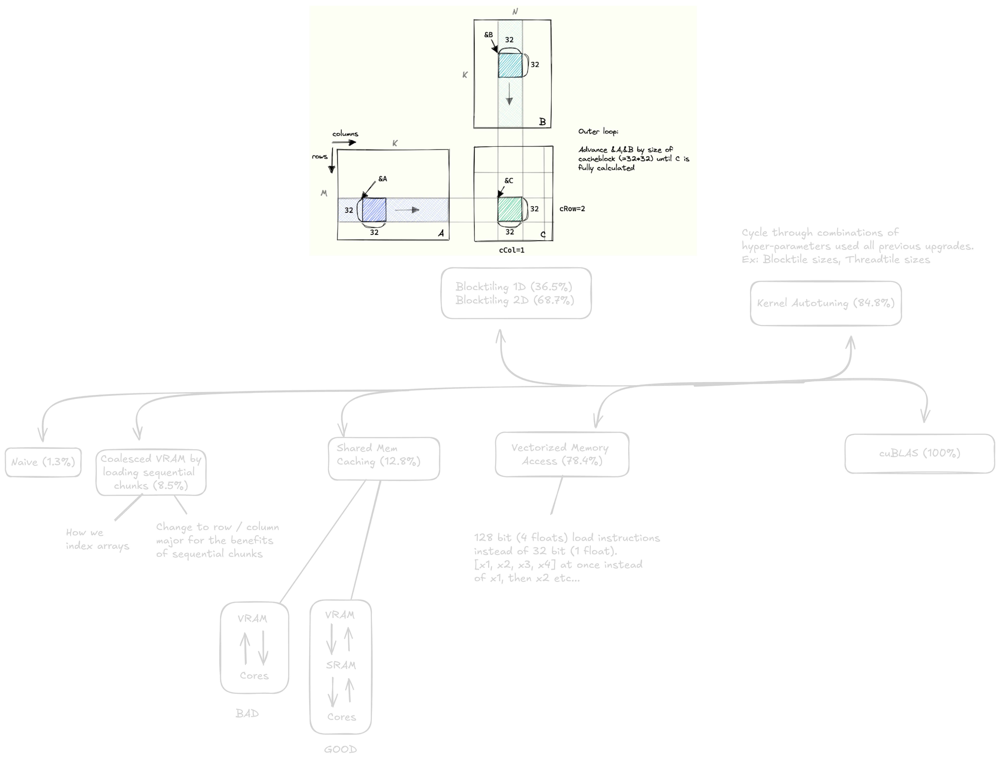

# Step-by-Step Optimization of Matrix Multiplication



1. Naive (easiest to understand but poor performance)
2. Coalesced Memory Access (ensuring that data is loaded in a way that is optimal for the GPU)
3. Shared Memory (reducing the number of global memory accesses increases memory bandwidth)
4. 1D/2D Blocktiling (splitting the work equally amongst all SMs / blocks in the grid)
5. Vectorized Memory Access (loading more data per instruction (128 bit instead of 32 bit))
6. Autotuning (grid search for the most optimal parameters for the kernel based on the GPU architecture)
7. cuBLAS (NVIDIA's closed source library for linear algebra operations like Matmul)

**Inspiration from Simon Boehm's [blog](https://siboehm.com/articles/22/CUDA-MMM) & [git repo](https://github.com/siboehm/SGEMM_CUDA)**

## Row Major vs Column Major

- cuBLAS expects matrices to be in column major format so transpose operations are usually a pre-condition
- A with size `N*M`
- Row Major: `A[i][j]` is stored in `A[i * N + j]`
- Column Major: `A[i][j]` is stored in `A[j * M + i]`

```python
# Row Major
A = [[1, 2, 3],
     [4, 5, 6],
     [7, 8, 9]]

# stored in memory
A = [1, 2, 3, 4, 5, 6, 7, 8, 9]

# Column Major
A = [[1, 4, 7],
     [2, 5, 8],
     [3, 6, 9]]

# stored in memory
A = [1, 4, 7, 2, 5, 8, 3, 6, 9]
```
