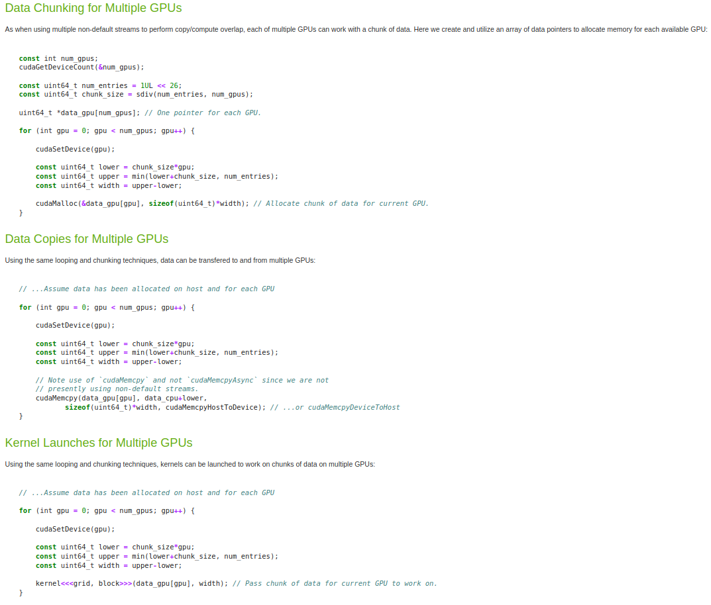
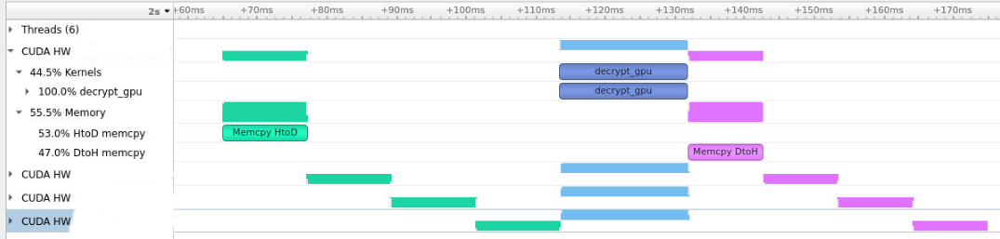
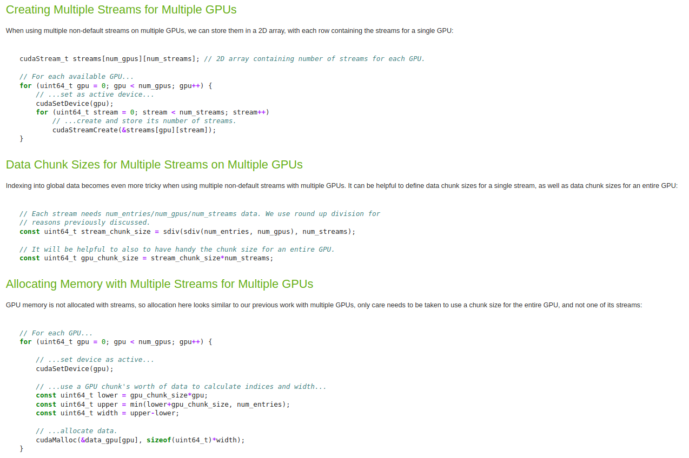
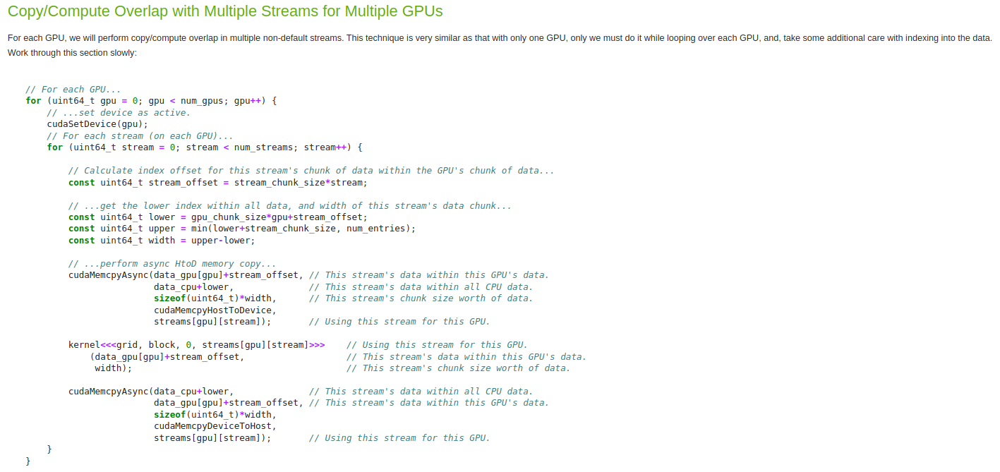

# Documentation for relevant(+adjacent) CUDA topics

1. Multi-GPU chunking of data

    Approach is quite straightforward, relevant functions are especially interesting.
    
    

    This method uses blocking memory operations, which creates the following profile (visual), indicating GPU idle times for no real reason.

    

2. Multi-GPU Streams (creation & copy/compute overlap)

    Create streams (parallel non-blocking) for multi-GPU use.

    

    Copy/Compute Overlap Sketch

    

    Synchronization for async needed!

    ```cpp
    for (int i = 0; i < numGpus; i++) {
        cudaSetDevice(i);
        for (int s = 0; s < numStreams; s++) {
            cudaStreamSynchronize(streams[i][s]);
        }
    }
    ```
